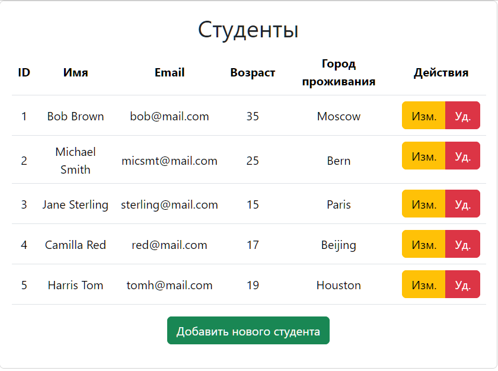
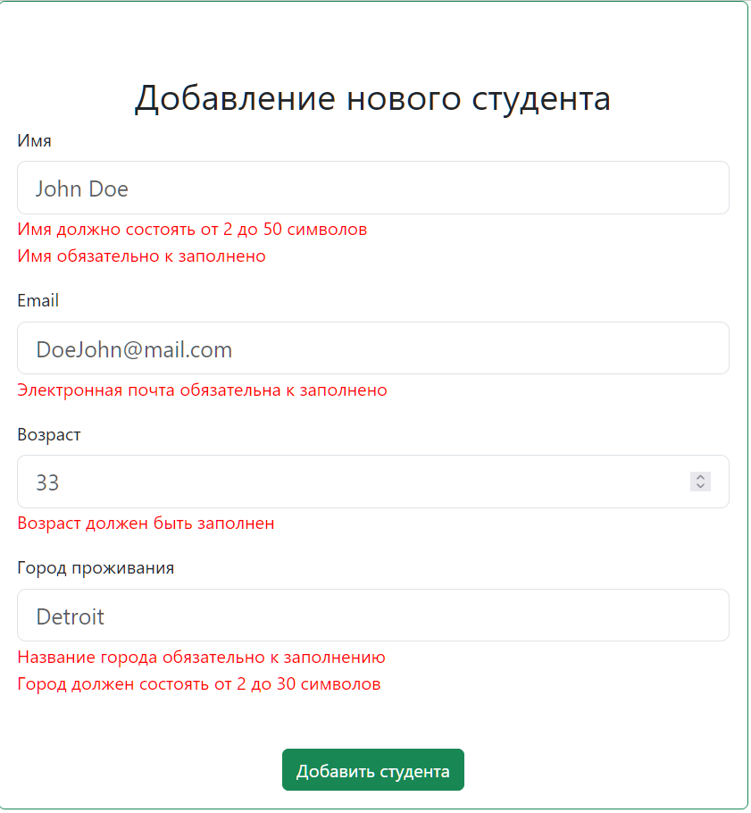
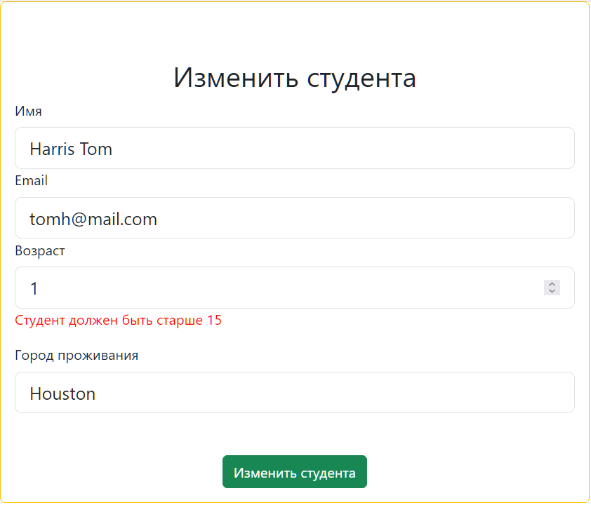
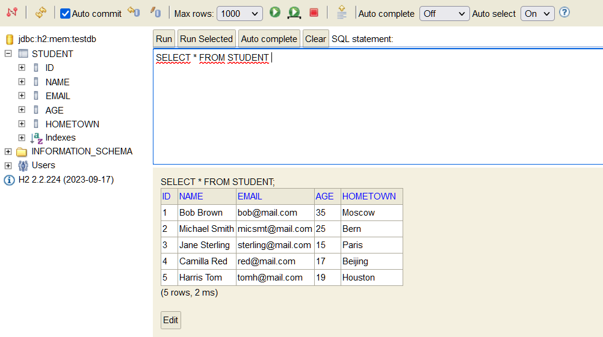

# SpringBootMVCPractice

Учебное вэб приложение написанное с использованием spring boot и простой CRUD функциональностью. 
Использовал на практике связку springboot3 и различных баз данных (H2, MySql, Postgres).
Разработал простейший web UI на связке шаблонного движка thymeleaf и twitter bootstrap 5.

## Что я использовал

* Возможности core java
  + Optional для потенциально не инициализированных переменных
  + Структурирование приложения с использованием логического разделения классов по пакетам
  + Версия Java 17 (задана `java.version` в pom.xml)
* Шаблоны проектирования и архитектурные решения
  + MVC
  + Принципы SOLID при проектировании классов
* Spring boot
  + Подключен JPA (hibernate)
  + Подключена валидация (jakarta validation)
  + Настройка параметров приложения через `application.properties` (например, порт контейнера сервлетов через `server.port`)
* Maven
  + Использую для автоматической сборки приложения
  + Сборка в fatjar плагином spring-boot
* Lombok
  + Для авто генерации шаблонного кода
  + Использовались аннотации: @Date @AllArgsConstructor @NoArgsConstructor @EqualsAndHashCode @Slf4j
* В качестве базы данных использовал H2, MySql, Postgres
  + Различия в SQL для разных диалектов СУБД (типы данных, синтаксис запросов) 
  + Переключение баз данных производится путем раскомментирования необходимой секции в application.properties 
    и нужного драйвера базы данных в pom.xml (mysql-connector-java, h2 и postgresql)
  + H2: 
    - Сконфигурирована вэб консоль - позволяет удобно посмотреть состояние БД прямо из браузера
    - База настроена на работу как inmemory, так и с файлом (секция в application.properties)
    - Происходит инициализация файлами (`schema-h2.sql` и `data.sql`, нужно изменить параметр `spring.sql.init.platform`)
  + MySql
    - Реквизиты доступа указываются в application.properties (базу необходимо предварительно создать)
    - Происходит инициализация файлами (`schema-mysql.sql` и `data.sql`, нужно изменить параметр `spring.sql.init.platform`) 
  + Postgres
    - Реквизиты доступа указываются в application.properties (базу необходимо предварительно создать)
    - Происходит инициализация файлами (`schema-postgres.sql` и `data-postgres.sql` + `data.sql`, нужно изменить параметр `spring.sql.init.platform`)
* В Java классах использую аннотации Jakarta Bean Validation
  + @NotEmpty @Size @Email @NotNull @Min
  + Настройка сообщений об ошибках валидации на русском языке
* Создание пользовательского вэб интерфейса при помощи Thymeleaf + Bootstrap5 (см. скриншоты ниже)
  + Язык движка шаблонов thymeleaf
  + Базовые знания html (теги, формы и т.п.)
  + Базовая работа с css (подключение bootstrap, написание и вынос в отдельный файл свои стилей)


## Как запустить

```shell
mvn clean package
cd target
java -jar SpringMVC.jar
```

Приложение работает на 8888 порту!

* [Приложение](http://localhost:8888/mytable)
* [Консоль H2](http://localhost:8888/h2-console)

## Скриншоты






